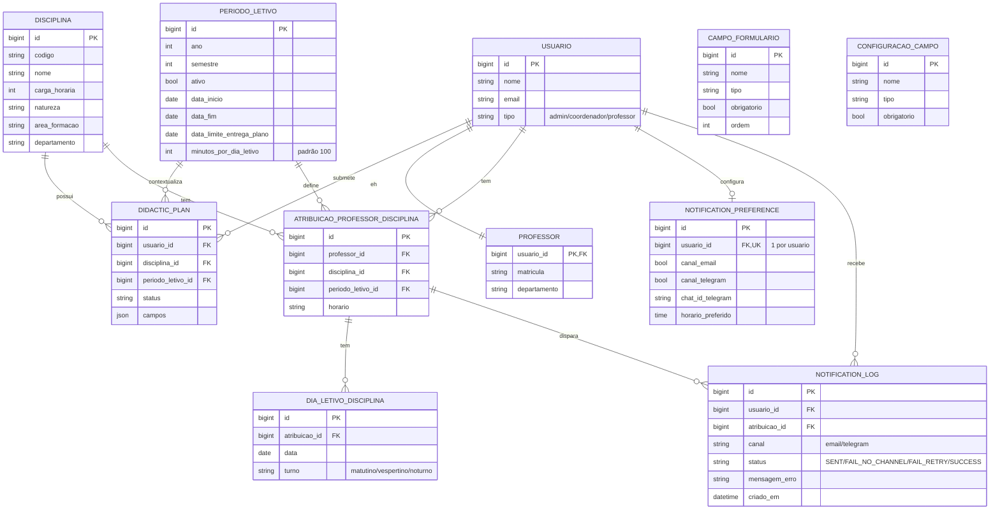

# 3.1 Diagrama Entidade-Relacionamento (DER)

Derivado direto da tabela de persistência da seção 3: todas as classes marcadas `Persistente? = Sim` entram no DER. Enquanto o diagrama de classes mostra visão de objeto (composição, herança, comportamento), o DER mostra visão relacional: tabela, PK, FK e cardinalidade.

## Regras de conversão aplicadas

- **Herança de `Usuario`** (admin/coordenador/professor): estratégia de **tabela única com coluna discriminadora** `tipo` — evita duplicação de FK em `professor`, único caso onde subtipo carrega atributo próprio (matrícula, departamento), resolvido com tabela `professor` referenciando `usuario.id` 1:1.
- **Composição `AtribuicaoProfessorDisciplina *-- DiaLetivoDisciplina`** → FK `atribuicao_id` na tabela "muitos" (`dia_letivo_disciplina`), apontando para PK de `atribuicao_professor_disciplina`.
- **`CampoFormulario`/`ConfiguracaoCampo`**: tabelas próprias (não embutidas), pois são configuráveis dinamicamente por Admin/Coordenador — não são apenas enum fixo.
- **`DidacticPlan.campos`**: campo `json` (não normalizado) para suportar formulário dinâmico, conforme RNF de flexibilidade — decisão de modelagem documentada, não schema fixo.

Toda cardinalidade acima confere com a multiplicidade equivalente do diagrama de classes (`docs/03-diagrama-classes.md`).
