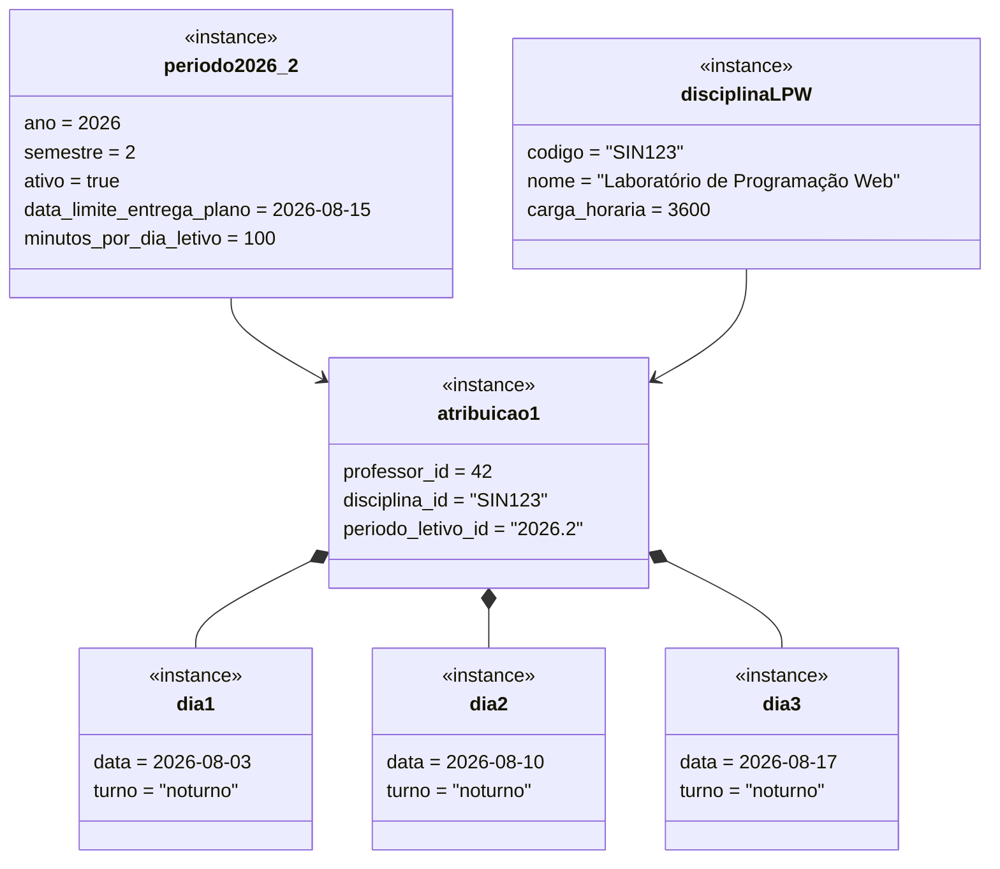

# 4. Diagrama de Objetos

Instantâneo do diagrama de classes em tempo de execução, usado para validar a regra RF11 (`dias letivos × minutos_por_dia_letivo ≥ carga_horaria`) e a composição `AtribuicaoProfessorDisciplina *-- DiaLetivoDisciplina` com um cenário concreto: disciplina "Laboratório de Programação Web" (carga horária 60h = 3600 min), período 2026.2, minutos por dia letivo padrão = 100.

## Validação demonstrada

- `atribuicao1` tem 3 dias letivos cadastrados (`dia1`, `dia2`, `dia3`) → `3 × 100 min = 300 min`.
- Se `disciplinaLPW.carga_horaria = 3600 min` (60h), esse cenário **falha** a regra RF11 (`300 < 3600`) — confirma que o total exigido de dias letivos para uma disciplina de 60h, a 100 min/dia, é de **36 dias letivos**, não 3. Esse número concreto é o que vira massa de teste na seção de TDD (`docs/11-implementacao-ddd-clean-tdd.md`): teste que rejeita atribuição com poucos dias e teste que aceita com 36+ dias.
- A composição `atribuicao1 *-- dia1/dia2/dia3` confirma que os dias letivos só existem enquanto a atribuição existir (exclusão em cascata ao remover a atribuição).
