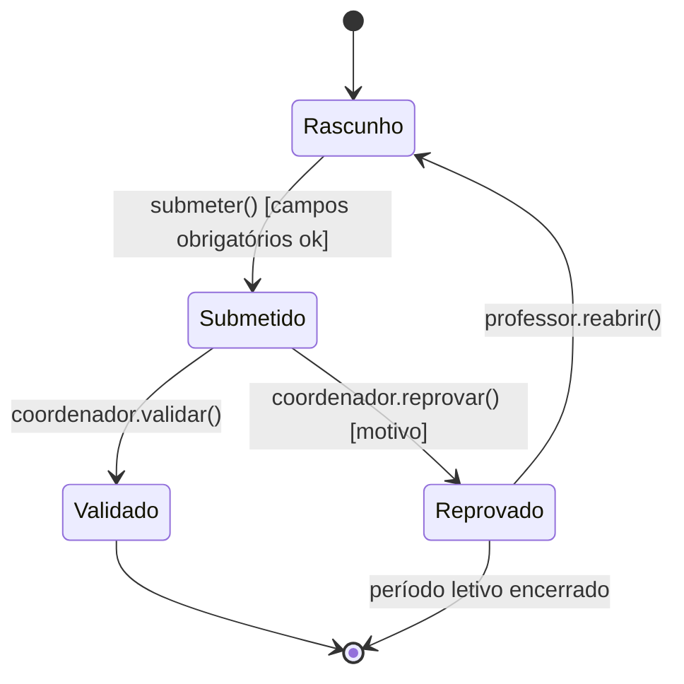

# 5. Diagrama de Estados

Avaliação: `DidacticPlan.status` (`submetido/validado/reprovado`) é candidato a ciclo de vida complexo — múltiplos estados com regras de quem pode transicionar. Confirmado como aplicável.

Nenhuma outra entidade do diagrama de classes (`docs/03-diagrama-classes.md`) tem ciclo de vida com mais de um estado controlado (Usuario, Disciplina, PeriodoLetivo, AtribuicaoProfessorDisciplina são essencialmente CRUD com flag `ativo` booleana, não uma máquina de estados).

## Diagrama de Estados — DidacticPlan

## Regras de transição

| Transição | Evento | Guarda | Ator |
|-----------|--------|--------|------|
| Rascunho → Submetido | `submeter()` | todos os campos obrigatórios preenchidos (UC2) | Professor |
| Submetido → Validado | `validar()` | plano atende aos critérios do período | Coordenador |
| Submetido → Reprovado | `reprovar(motivo)` | inconsistência encontrada | Coordenador |
| Reprovado → Rascunho | `reabrir()` | reabertura permitida antes da data limite | Professor |

Essas transições viram, na implementação (`docs/11-implementacao-ddd-clean-tdd.md`), validação dentro do método da entidade de domínio `DidacticPlan` (ex: `plan.validar()` só é permitido se `status == "submetido"`) — nunca troca de status "solta" direto no banco.
