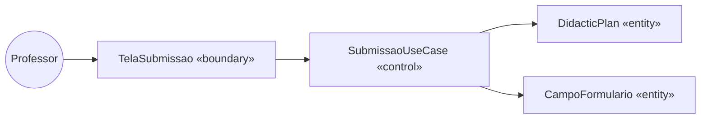

# 6. Classes de Fronteira, Controle e Entidade (Boundary-Control-Entity)

Reclassificação das classes do diagrama de classes (`docs/03-diagrama-classes.md`) em 3 estereótipos de análise. Essa separação vira, na seção 10, as camadas de Clean Architecture (boundary → adapter/interface, control → use case, entity → domain).

| Caso de Uso | Boundary | Control | Entities |
|-------------|----------|---------|----------|
| UC1 — Submeter Plano Didático | TelaSubmissao «Frontend Next.js» | SubmissaoUseCase | Usuario, DidacticPlan, CampoFormulario |
| UC6 — Importar Campos Fixos | TelaImportacao «Frontend Coordenador» | ImportarCamposUseCase | CampoFormulario, ConfiguracaoCampo |
| UC7 — Visualizar Planos | TelaVisualizacao «Frontend Coordenador» | VisualizaPlanosUseCase | DidacticPlan |
| UC8 — Gerenciar Campos | TelaGerenciaCampos «Admin Frontend» | GerenciaCamposUseCase | CampoFormulario, ConfiguracaoCampo |
| UC11 — Importar/Gerenciar Professores | TelaGerenciaProfessores «Frontend Coordenador» | GerenciaProfessoresUseCase | Usuario, Professor |
| UC12 — Atribuir Professores às Disciplinas | TelaAtribuicaoDisciplinas «Frontend Coordenador» | AtribuicaoDisciplinasUseCase | Usuario, Disciplina, PeriodoLetivo, DiaLetivoDisciplina |
| UC13 — Definir Período Letivo | TelaPeriodoLetivo «Frontend Coordenador» | PeriodoLetivoUseCase | PeriodoLetivo |
| UC14 — Cadastrar Dias Letivos | TelaDiasLetivos «Frontend Coordenador» | CadastrarDiasLetivosUseCase | DiaLetivoDisciplina, AtribuicaoProfessorDisciplina |
| UC15 — Notificar Atrasos (RF12) | PainelNotificacoes «Frontend Coordenador» + JobScheduler «infra APScheduler» | DetectarAtrasosUseCase | AtribuicaoProfessorDisciplina, NotificationPreference, NotificationLog, INotifier (port → EmailSmtpNotifier, TelegramNotifier) |
| UC16 — Configurar Canais de Notificação (RF12) | TelaConfigCanais «Admin Frontend» | ConfigurarCanaisUseCase | NotificationPreference, INotifier |

## Diagrama de Robustez — UC1 (exemplo)

Regra: 1 boundary por tela/interface de ator; 1 control por caso de uso; entidades vêm do diagrama de classes da seção 3.
