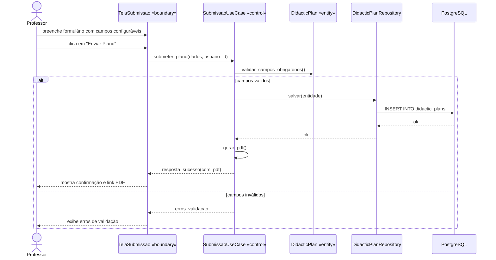
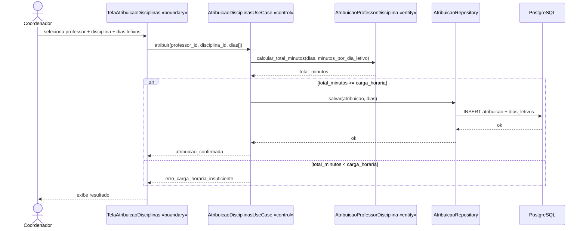
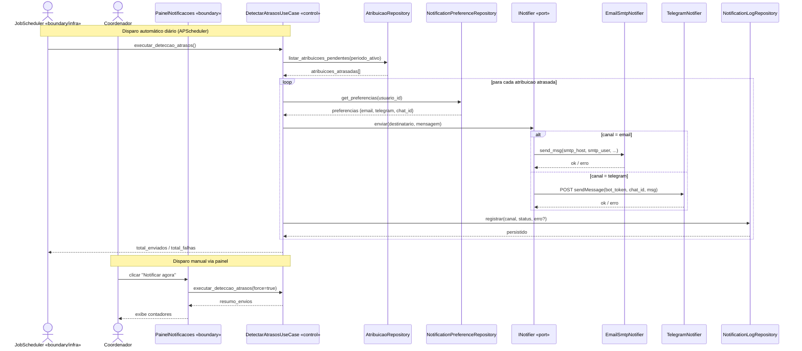

# 7. Diagrama de Sequência

## UC1 — Submeter Plano Didático

## UC12 — Atribuir Professor à Disciplina (com validação RF11)

Rastreabilidade: mesmos nomes de boundary/control/entity da tabela BCE (`docs/07-boundary-control-entity.md`); mesma ordem de chamada que vira teste de use case no plano de TDD (`docs/11-implementacao-ddd-clean-tdd.md`).

## UC15 — Notificar Atrasos de Entrega (RF12)

