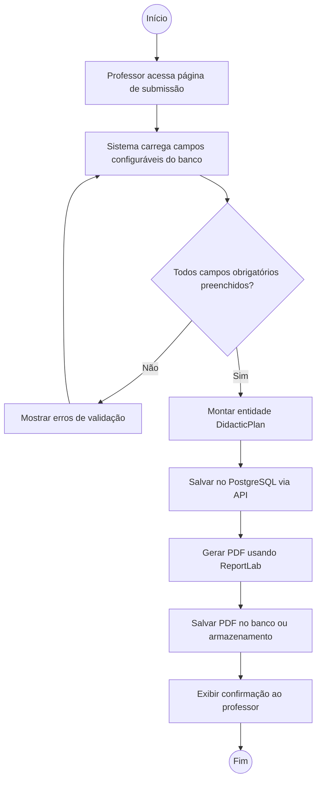
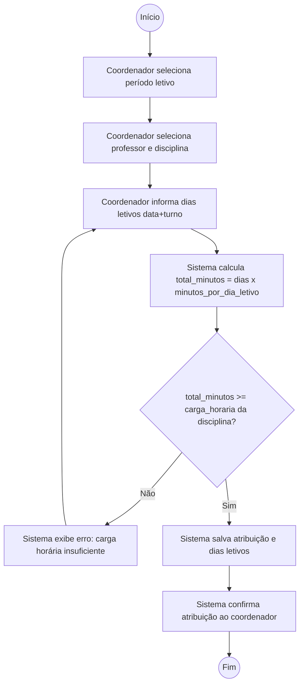

# 8. Diagrama de Atividades

## Fluxo de Submissão de Plano Didático (UC1)

## Fluxo de Atribuição de Professor à Disciplina, com validação RF11 (UC12/UC14)

Raia Coordenador / Raia Sistema:

Raias: ações `B1/B2/B3` pertencem ao Coordenador; `B4/D1/B5/B6/B7` pertencem ao Sistema (backend de validação, RF11).
