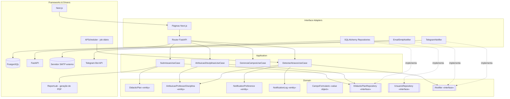

# 9. Diagrama de Componentes

Visão estrutural em módulos/pacotes, materializando as camadas de Clean Architecture (`docs/11-implementacao-ddd-clean-tdd.md`).

Regra de leitura: seta sempre aponta de quem depende para quem é dependido. `Domain` nunca depende de `Adapters`/`Infra` — só recebe, via interface implementada (`RepoPort`/`RepoPort2`).
