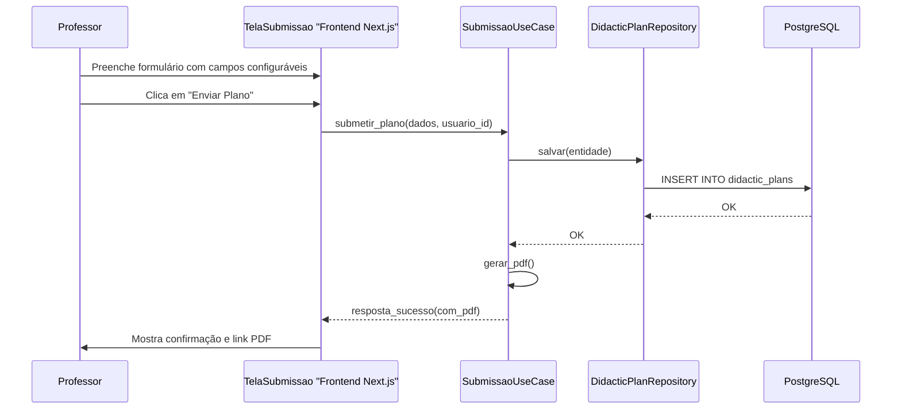
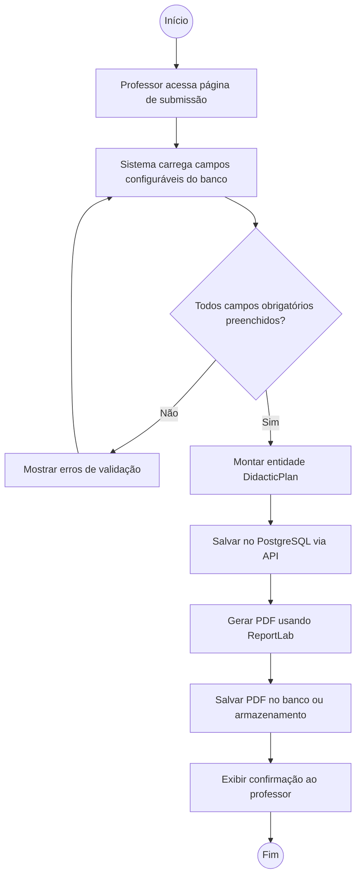

# Documento de Software - Sistema de Planos Didáticos

> **Análise do modelo existente**: A partir do estudo do plano didático "Plano-Didatico-v2023_LabPW.docx" (disciplina Laboratório de Programação Web), identificou-se uma estrutura com campos institucionais padronizados (carga horária, coordenador, departamento, período) e campos variáveis específicos por professor (atividades avaliativas, cronograma, metodologia, recursos). Este modelo serve como referência para os campos configuráveis do sistema.
> 
> **Fluxo por Semestre**: O Coordenador define o período letivo, importa professores do sistema de RH, atribui professores às disciplinas, e então os Professores preenchem seus planos didáticos para aquele semestre. O Coordenador pode então visualizar e monitorar a entrega dos planos.

## 1. Levantamento de Requisitos

| ID | Descrição | Prioridade | Ator/Origem |
|----|-----------|-----------|-------------|
| RF01 | Sistema deve permitir que professores submetam planos didáticos com campos configuráveis | Alta | Coordenador de Curso |
| RF02 | Sistema deve armazenar planos didáticos no banco de dados PostgreSQL | Alta | Coordenador de Curso |
| RF03 | Sistema deve gerar PDF do plano didático submetido | Média | Professor |
| RF04 | Admin deve poder criar/editar campos configuráveis do formulário | Alta | Administrador |
| RF05 | Coordenador deve visualizar lista de planos submetidos por professor | Média | Coordenador |
| RF06 | Sistema deve enviar lembretes automáticos para documentos não entregues | Média | Sistema |
| RF07 | Coordenador deve poder importar lista de professores (CSV/API) | Alta | Coordenador |
| RF08 | Coordenador deve poder gerenciar dados dos professores | Média | Coordenador |
| RF09 | Coordenador deve poder definir período letivo (ano/semestre) | Alta | Coordenador |
| RF10 | Coordenador deve poder atribuir professores às disciplinas por período letivo | Alta | Coordenador |
| RF11 | Sistema deve validar que o total de minutos (dias letivos × minutos_por_dia_letivo) seja ≥ carga horária da disciplina | Alta | Coordenador |
| RNF01 | Sistema deve ser 100% gratuito (zero investimento financeiro) | Crítica | Universidade |
| RNF02 | API deve ser type-safe com FastAPI + PostgreSQL | Alta | Coordenador |
| RNF03 | Frontend Next.js deve ser responsivo e acessível | Alta | Professor |
| RNF04 | Dados devem persistir entre sessões | Alta | Coordenador |
| RNF05 | Sistema deve suportar múltiplos professores simultâneos | Média | Administrador |
| RNF06 | Sistema deve manter histórico de períodos letivos anteriores | Média | Coordenador |

## 2. Distinção de Campos: Fixos vs Configuráveis

A arquitetura do sistema divide os campos do plano didático em duas categorias, com hierarquia de permissões definida:

### Campos Fixos (Institucionais - Lidos do Sistema Acadêmico)
Informações importadas do sistema acadêmico/RH e lidos por professores e coordenadores:
- **Campus/Curso**: Nome do curso (ex: "Bacharelado em Sistemas de Informação")
- **Código da disciplina**: Código oficial da disciplina
- **Coordenador do curso**: Nome do coordenador responsável
- **Nome da disciplina**: Título específico do curso
- **Docente responsável**: Nome do professor que submete
- **Carga horária total**: Horas/aula e créditos
- **Natureza da disciplina**: Prática/Obrigatória
- **Área de formação DCN**: Específica
- **Departamento que oferta**: Nome do departamento
- **Cabeçalho institucional**: Ministério, CEFET-MG, Diretoria

### Campos Configuráveis (Preenchidos pelo Professor)
Detalhes específicos do plano que o professor preenche:
- **Data de entrega**: Data limite para entrega do plano
- **Atividades avaliativas**: Tipos e descrições (Prova 1, Projeto, etc.)
- **Recursos utilizados**: Equipamentos, softwares, laboratórios
- **Cronograma detalhado**: Data e atividade de cada aula
- **Metodologia de ensino**: Abordagem pedagógica utilizada
- **Observações**: Notas específicas do professor
- **Valores das atividades**: Percentuais de cada avaliação

### Hierarquia de Permissões

| Perfil | Permissões sobre Campos Fixos | Permissões sobre Campos Variáveis | Permissões sobre Gestão |
|--------|------------------------------|-----------------------------------|--------------------------|
| **Admin** | Criar/Editar/Configurar fontes | Criar/Editar/Configurar campos | Gerenciar sistema completo |
| **Coordenador** | Importar de sistemas externos + Definir data de entrega e minutos por aula do período | Visualizar apenas | Importar/gerenciar professores, atribuir professores às disciplinas (por semestre), cadastrar dias letivos |
| **Professor** | Visualizar apenas | Editar/Preencher | Nenhuma |

**Implicação da Hierarquia:** Como Coordenador > Professor, o Professor também pode visualizar os campos fixos importados pelo Coordenador. Como Admin > todos, o Administrador pode gerenciar tanto os campos fixos (alterando fontes de importação) quanto os campos variáveis. O Coordenador atua como gestor pedagógico, importando e atribuindo professores às disciplinas a cada semestre letivo, definindo também a data de entrega padrão e os minutos por dia letivo.

## 3. Diagrama de Casos de Uso

```mermaid
flowchart LR
    Admin((Administrador)) --|> Coordenador((Coordenador)) --|> Professor((Professor))
    
    Professor --> UC1[Submeter Plano Didático]
    UC1 -.include.-> UC2[Validar Campos Obrigatórios]
    UC1 -.include.-> UC3[Salvar no Banco de Dados]
    UC1 -.extend.-> UC4[Gerar PDF do Plano]
    UC1 -.extend.-> UC5[Enviar Lembrete Automático]
    
    Coordenador --> UC6[Importar Campos Fixos]
    Coordenador --> UC7[Visualizar Planos de Professores]
    Coordenador --> UC11[Importar e Gerenciar Professores]
    Coordenador --> UC12[Atribuir Professores às Disciplinas]
    Coordenador --> UC13[Definir Período Letivo]
    Coordenador --> UC14[Cadastrar Dias Letivos]
    
    Admin --> UC8[Gerenciar Campos do Formulário]
    Admin --> UC9[Visualizar Todos os Planos]
    Admin --> UC10[Configurar Sistema]
```

### Casos de Uso detalhados:

**UC1 - Submeter Plano Didático**
- Ator: Professor
- Pré-condição: Professor está logado
- Fluxo principal: Professor visualiza campos fixos (importados) → Preenche campos variáveis → Clica em "Enviar" → Sistema salva no banco → Sistema gera PDF → Confirmação exibida
- Pós-condição: Plano didático registrado com data de entrega e campos preenchidos

**UC2 - Validar Campos Obrigatórios**
- Ator: Sistema (backend)
- Fluxo principal: Sistema verifica se todos os campos obrigatórios estão preenchidos antes de salvar
- Fluxo alternativo: Se campos faltam, retorna erros de validação para o frontend

**UC6 - Importar Campos Fixos**
- Ator: Coordenador
- Fluxo principal: Coordenador acessa painel → Sistema exibe dados importados do sistema acadêmico/RH → Coordenador confirma/atualiza valores → Campos fixos ficam disponíveis para os professores
- Pós-condição: Campos fixos sincronizados com os sistemas externos

**UC8 - Gerenciar Campos do Formulário**
- Ator: Administrador
- Fluxo principal: Admin acessa painel → Adiciona/remove/edita campos variáveis → Define tipos (text/select/textarea/date) → Define se obrigatório → Define ordem de exibição → Campos são salvos e passam a aparecer nos formulários dos professores

**UC11 - Importar e Gerenciar Professores**
- Ator: Coordenador
- Pré-condição: Coordenador está logado e tem acesso ao sistema acadêmico
- Fluxo principal: Coordenador acessa painel de gestão → Importa lista de professores do sistema de RH (CSV/API) → Sistema valida dados → Coordenador revisa/ajusta informações → Professores ficam disponíveis para atribuição
- Pós-condição: Base de professores atualizada no sistema para o semestre corrente

**UC12 - Atribuir Professores às Disciplinas**
- Ator: Coordenador
- Pré-condição: Professores e disciplinas já importados
- Fluxo principal: Coordenador seleciona semestre letivo → Lista disciplinas disponíveis → Atribui professor a cada disciplina → Informa os dias letivos (data+turno) em que a disciplina é ministrada → Sistema valida que a soma de minutos (dias × minutos_por_dia) é maior ou igual à carga horária → Salva atribuições
- Pós-condição: Professores vinculados às disciplinas do período, com cronograma letivo validado
- **Regra de Validação RF11**: Para cada disciplina atribuída, a soma de (quantidade de dias letivos × minutos por dia letivo) deve ser ≥ carga horária total da disciplina. O coordenador pode definir os minutos por dia letivo (padrão: 100 min) na configuração do período letivo.

**UC13 - Definir Período Letivo**
- Ator: Coordenador
- Fluxo principal: Coordenador define ano/semestre (ex: 2026.2) → Informa data de entrega padrão dos planos didáticos → Informa minutos por dia letivo (padrão: 100 min) → Sistema cria contexto do período → Todos os professores veem apenas planos do período ativo → Histórico de períodos anteriores permanece acessível
- Pós-condição: Novo período letivo ativo, com data de entrega e minutos por dia letivo configurados
- **Campos configuráveis do Período**: `data_limite_entrega_plano` (data) e `minutos_por_dia_letivo` (int, padrão 100)

**UC14 - Cadastrar Dias Letivos da Disciplina**
- Ator: Coordenador
- Pré-condição: Atribuição professor-disciplina já criada
- Fluxo principal: Coordenador seleciona atribuição → Lista disciplinas disponíveis → Para cada disciplina, cadastra os dias letivos (data + turno: matutino/vespertino/noturno) → Sistema calcula total de minutos → Valida se total >= carga horária da disciplina → Salva dias letivos
- Pós-condição: Dias letivos cadastrados e validados para a disciplina no período
- **Regra de Validação (RF11)**: `SUM(dias letivos) × minutos_por_dia_letivo` ≥ `carga_horaria` da disciplina

## 4. Diagrama de Classes

```mermaid
classDiagram
    class Usuario {
        -id: int
        -nome: str
        -email: str
        -tipo: str "admin/coordenador/professor"
        +eh_admin(): bool
        +eh_coordenador(): bool
        +eh_professor(): bool
    }
    
    class CampoFormulario {
        -id: int
        -nome: str
        -tipo: str "text/select/textarea/date"
        -obrigatorio: bool
        -ordem: int
    }
    
    class DidacticPlan {
        -id: int
        -professor_id: int
        -disciplina_id: int
        -periodo_letivo_id: int
        -status: str "submetido/validado/reprovado"
        -campos: JSON
        +gerar_pdf(): bytes
    }
    
    class ConfiguracaoCampo {
        -id: int
        -nome: str
        -tipo: str
        -obrigatorio: bool
    }
    
    class Professor {
        -usuario_id: int
        -departamento: str
        -matricula: str
    }
    
    class Disciplina {
        -id: int
        -codigo: str
        -nome: str
        -carga_horaria: int
        -natureza: str
        -area_formacao: str
        -departamento: str
    }
    
    class PeriodoLetivo {
        -id: int
        -ano: int
        -semestre: int
        -ativo: bool
        -data_inicio: date
        -data_fim: date
        -data_limite_entrega_plano: date
        -minutos_por_dia_letivo: int "padrão 100"
    }
    
    class AtribuicaoProfessorDisciplina {
        -id: int
        -professor_id: int
        -disciplina_id: int
        -periodo_letivo_id: int
        -horario: str
    }
    
    class DiaLetivoDisciplina {
        -id: int
        -atribuicao_id: int
        -data: date
        -turno: str "matutino/vespertino/noturno"
    }
    
    Usuario "1" -- "1" Professor : "1"
    Usuario "1" -- "0..*" DidacticPlan : "submete"
    DidacticPlan "1" -- "0..*" CampoFormulario : "usa"
    Admin "1" -- "0..*" CampoFormulario : "cria"
    Admin "1" -- "0..*" ConfiguracaoCampo : "gerencia"
    Coordenador "1" -- "0..*" CampoFormulario : "importa"
    Coordenador "1" -- "0..*" Disciplina : "importa/gerencia"
    Coordenador "1" -- "0..*" Professor : "importa/gerencia"
    Coordenador "1" -- "0..*" PeriodoLetivo : "define"
    Coordenador "1" -- "0..*" AtribuicaoProfessorDisciplina : "atribui"
    Coordenador "1" -- "0..*" DiaLetivoDisciplina : "cadastra"
    Disciplina "1" -- "0..*" DidacticPlan : "possui"
    PeriodoLetivo "1" -- "0..*" DidacticPlan : "contextualiza"
    PeriodoLetivo "1" -- "0..*" AtribuicaoProfessorDisciplina : "define"
    Professor "1" -- "0..*" AtribuicaoProfessorDisciplina : "tem"
    Disciplina "1" -- "0..*" AtribuicaoProfessorDisciplina : "recebe"
    AtribuicaoProfessorDisciplina "1" -- "0..*" DiaLetivoDisciplina : "tem"
    
    note para DidacticPlan "campos armazenados como JSON flexível"
    note para Usuario "Admin pode alterar/cadastrar campos\nCoordenador importa campos fixos\nProfessor preenche campos variáveis"
    note para PeriodoLetivo "data_limite_entrega_plano: data de entrega padrão para todos os planos\nminutos_por_dia_letivo: padrão 100, configurável"
    note para DiaLetivoDisciplina "RF11: dias × minutos/dia >= carga_horaria da disciplina"
```

### Persistência:

| Classe | Persistente? | Estratégia | Observação |
|--------|-------------|-----------|------------|
| Usuario | Sim | Tabela `usuario`, PK id | Discriminador `tipo` com hierarquia: admin > coordenador > professor |
| DidacticPlan | Sim | Tabela `didactic_plans`, PK id | FK → usuario_id, disciplina_id, periodo_letivo_id |
| CampoFormulario | Sim | Tabela `campo_formulario`, PK id | Admin gerencia, Coordenador importa |
| ConfiguracaoCampo | Sim | Tabela `configuracao_campo`, PK id | Campos do formulário (variáveis) |
| Professor | Sim | Tabela `professor`, PK usuario_id (FK Usuario) | Dados específicos do professor |
| Disciplina | Sim | Tabela `disciplina`, PK id | Importada do sistema acadêmico |
| PeriodoLetivo | Sim | Tabela `periodo_letivo`, PK id | Definido pelo Coordenador, inclui data_limite_entrega_plano e minutos_por_dia_letivo |
| AtribuicaoProfessorDisciplina | Sim | Tabela `atribuicao_professor_disciplina`, PK id | Relacionamento N-N por período |
| DiaLetivoDisciplina | Sim | Tabela `dia_letivo_disciplina`, PK id | FK → atribuicao_id, contém data+turno |

## 5. Diagrama Entidade-Relacionamento (DER)

```mermaid
erDiagram
    USUARIO ||--o{ DIDACTIC_PLAN : "submete"
    USUARIO ||--|| PROFESSOR : "eh"
    USUARIO ||--o{ ATRIBUICAO : "tem"
    DISCIPLINA ||--o{ DIDACTIC_PLAN : "possui"
    DISCIPLINA ||--o{ ATRIBUICAO : "tem"
    PERIODO_LETIVO ||--o{ DIDACTIC_PLAN : "contextualiza"
    PERIODO_LETIVO ||--o{ ATRIBUICAO : "define"
    ATRIBUICAO ||--o{ DIA_LETIVO : "tem"
    
    USUARIO {
        bigint id PK
        string nome
        string email
        string tipo "admin/coordenador/professor"
    }
    PROFESSOR {
        bigint usuario_id PK_FK
        string matricula
        string departamento
    }
    DISCIPLINA {
        bigint id PK
        string codigo
        string nome
        int carga_horaria
        string natureza
        string area_formacao
        string departamento
    }
    PERIODO_LETIVO {
        bigint id PK
        int ano
        int semestre
        bool ativo
        date data_inicio
        date data_fim
        date data_limite_entrega_plano
        int minutos_por_dia_letivo "padrão 100"
    }
    ATRIBUICAO_PROFESSOR_DISCIPLINA {
        bigint id PK
        bigint professor_id FK
        bigint disciplina_id FK
        bigint periodo_letivo_id FK
        string horario
    }
    DIA_LETIVO_DISCIPLINA {
        bigint id PK
        bigint atribuicao_id FK
        date data
        string turno "matutino/vespertino/noturno"
    }
    DIDACTIC_PLAN {
        bigint id PK
        bigint usuario_id FK
        bigint disciplina_id FK
        bigint periodo_letivo_id FK
        string status
        json campos
    }
    CAMPO_FORMULARIO {
        bigint id PK
        string nome
        string tipo
        bool obrigatorio
        int ordem
    }
    CONFIGURACAO_CAMPO {
        bigint id PK
        string nome
        string tipo
        bool obrigatorio
    }
```

## 6. Classes de Fronteira, Controle e Entidade

| Caso de Uso | Boundary | Control | Entities |
|-------------|----------|---------|----------|
| UC1 - Submeter Plano Didático | TelaSubmissao "Frontend Next.js" | SubmissaoUseCase | Usuario, DidacticPlan, CampoFormulario |
| UC6 - Importar Campos Fixos | TelaImportacao "Frontend Coordenador" | ImportarCamposUseCase | CampoFormulario, ConfiguracaoCampo |
| UC8 - Gerenciar Campos | TelaGerenciaCampos "Admin Frontend" | GerenciaCamposUseCase | CampoFormulario, ConfiguracaoCampo |
| UC7 - Visualizar Planos | TelaVisualizacao "Coordenador Frontend" | VisualizaPlanosUseCase | DidacticPlan |
| UC11 - Importar/Gerenciar Professores | TelaGerenciaProfessores "Frontend Coordenador" | GerenciaProfessoresUseCase | Usuario, Professor |
| UC12 - Atribuir Professores às Disciplinas | TelaAtribuicaoDisciplinas "Frontend Coordenador" | AtribuicaoDisciplinasUseCase | Usuario, Disciplina, PeriodoLetivo, DiaLetivoDisciplina |
| UC13 - Definir Período Letivo | TelaPeriodoLetivo "Frontend Coordenador" | PeriodoLetivoUseCase | PeriodoLetivo |
| UC14 - Cadastrar Dias Letivos | TelaDiasLetivos "Frontend Coordenador" | CadastrarDiasLetivosUseCase | DiaLetivoDisciplina, AtribuicaoProfessorDisciplina |

## 7. Diagrama de Sequência - Submeter Plano Didático



## 8. Diagrama de Atividades - Fluxo de Submissão



## 8. Diagrama de Componentes

```mermaid
flowchart TB
    subgraph Adapters["Interface Adapters"]
        Controller[Router FastAPI]
        NextPage[Páginas Next.js]
    end
    subgraph Application["Application"]
        UseCase[SubmissaoUseCase]
        GerenciaCamposUseCase
    end
    subgraph Domain["Domain"]
        Entity[DidacticPlan "entity"]
        ValueObj[CampoFormulario "value object"]
        RepoPort[[ICampoRepository "interface"]]
        RepoPort2[[IUsuarioRepository "interface"]]
    end
    subgraph Infra["Frameworks & Drivers"]
        DB[(PostgreSQL)]
        FastAPI[FastAPI]
        Nextjs[Next.js]
        ReportLab[ReportLab PDF generation]
    end

    Nextjs --> Controller
    Controller --> UseCase
    UseCase --> Entity
    UseCase --> RepoPort
    UseCase --> ReportLab
    RepoPort -.implementa.-> Infra
    FastAPI --> DB
    Nextjs --> FastAPI
```

## 10. Implementação: DDD, Clean Architecture, TDD

### Estrutura de pastas proposta:

```
src/
  domain/            <- entidades DDD, value objects, interfaces de repository
    entities/
      user.py
      didactic_plan.py
    value_objects/
      field_config.py
    repositories/
      user_repository.py
      didactic_plan_repository.py
  application/        <- use cases
    use_cases/
      submit_didactic_plan.py
      manage_fields.py
  adapters/
    controllers/       <- boundary de entrada (REST FastAPI)
      didactic_plan.py
    repositories/       <- implementação concreta
      sqlalchemy_didactic_plan.py
      sqlalchemy_user.py
  infra/               <- config framework, ORM, conexão banco
    database.py
    security.py
```

### TDD - Pirâmide esperada:

1. **Testes Unitários de Domínio** (muito numerosos): Testes de entidade `DidacticPlan` - validação de campos, geração de PDF, regras de negócio
2. **Testes de Use Case** (médios): `SubmissaoUseCase` usando fakes de repository em memória
3. **Testes de Integração** (poucos): Repository real contra SQLite/Postgres, mapeamento ORM
4. **Testes E2E** (mínimos): Cypress/Playwright testando fluxos do frontend

### RF → Casos de uso → Testes:

| RF | Caso de Uso | Teste de Aceitação |
|----|-------------|-------------------|
| RF01 | UC1 Submeter Plano Didático | Teste que professor pode submeter plano com todos os campos |
| RF02 | UC3 Salvar no Banco | Teste que dado persiste no PostgreSQL |
| RF03 | UC4 Gerar PDF | Teste que PDF é gerado com conteúdo correto |
| RF04 | UC6 Gerenciar Campos | Teste que admin pode criar novo campo de formulário |
| RF07 | UC11 Importar Professores | Teste que coordenador importa lista de professores via CSV |
| RF09 | UC13 Definir Período Letivo | Teste que coordenador cria período letivo com data_limite e minutos_por_dia_letivo |
| RF10 | UC12 Atribuir Professores | Teste que coordenador atribui professor a disciplina por período |
| RF11 | UC14 Cadastrar Dias Letivos | Teste que sistema valida que `dias × minutos_por_dia_letivo >= carga_horaria` |

## 11. Checklist Final do Documento

- [x] 1. Requisitos funcionais e não funcionais (tabela completada)
- [x] 2. Diagrama de casos de uso com atores (+ herança de ator), include, extend
- [x] 3. Descrição textual dos casos de uso principais (pré/pós-condição, fluxos)
- [x] 4. Diagrama de classes com composição, agregação, herança e multiplicidades
- [x] 5. Marcação de persistência das entidades
- [x] 6. Diagrama entidade-relacionamento (DER) — feito
- [x] 7. Classes de fronteira/controle/entidade mapeadas por caso de uso
- [x] 8. Diagrama de sequência dos casos de uso principais
- [x] 9. Diagrama de atividade para os fluxos principais
- [x] 10. Diagrama de componentes (camadas Clean Architecture)
- [x] 11. Mapeamento DDD (aggregates, entities, value objects, repositories)
- [x] 12. Estrutura de camadas Clean Architecture (domain/application/adapters/infra)
- [ ] 13. Plano de testes TDD por caso de uso (pendente - será criado durante implementação)
- [x] 14. Rastreabilidade: cada RF aparece em pelo menos um caso de uso

---

**Data da conversa:** 1º de setembro de 2026  
**Projeto:** Sistema de Planos Didáticos - Administrativo, sem custos financeiros  
**Stack:** FastAPI + PostgreSQL + Next.js + Python + SQLAlchemy + Alembic + Docker